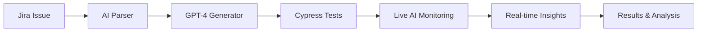

# AI-Powered Cypress Test Automation

> Automatically generate comprehensive end-to-end tests from Jira requirements using artificial intelligence with real-time failure analysis.

[](https://nodejs.org/)
[](https://python.org/)
[](https://cypress.io/)
[](https://openai.com/)

## Overview

This system automates quality assurance by converting Jira requirements into executable Cypress tests using GPT-4. It eliminates manual test writing while ensuring comprehensive coverage and consistent quality. **Now enhanced with real-time AI-powered failure analysis and intelligent debugging assistance.**

## Key Features

- **Automated Test Generation**: Transform requirements into tests in minutes
- **Jira Integration**: Direct pipeline from tickets to executable tests  
- **AI-Powered Analysis**: Natural language processing for complex requirements
- **🆕 Real-Time AI Analysis**: Live error detection with intelligent debugging hints during test execution
- **🆕 Pattern-Based Intelligence**: Recognizes common Cypress issues and provides instant solutions
- **🆕 Enhanced Error Recognition**: Contextual failure analysis with actionable remediation steps
- **Consistent Quality**: Standardized test patterns and best practices
- **Multi-Scenario Coverage**: Automatic generation of positive and negative test cases

## ✨ Enhanced AI Failure Analysis

### Live Error Detection & Coaching
- **Instant AI hints** when errors occur during test runs
- **Smart pattern matching** for common Cypress failure scenarios
- **Real-time debugging guidance** displayed directly in terminal
- **Comprehensive post-execution analysis** of complete test logs
- **Color-coded insights** for immediate visual recognition

### Supported Error Categories
| Error Type | AI Detection | Example Solution |
|------------|--------------|------------------|
| 🔧 Installation Issues | Cypress verification failures | `npx cypress install --force` |
| 🔍 Element Not Found | Selector/timing problems | Add `cy.wait()` or check selectors |
| ⏰ Timeout Errors | Operation timeouts | Increase timeout: `{timeout: 15000}` |
| 👁️ Visibility Issues | Element not interactable | Use `cy.scrollIntoView()` |
| ❌ Assertion Failures | Expected value mismatches | Verify test data and assertions |
| 🌐 Network Issues | Connectivity problems | Check baseUrl or add network stubbing |

## Architecture



**Technology Stack:**
- LangGraph for AI workflow orchestration
- OpenAI GPT-4 for intelligent test generation and failure analysis
- Cypress for end-to-end testing
- Atlassian Jira API for requirement management
- ChromaDB for vector storage and intelligent retrieval
- Colorama for enhanced terminal output

## Quick Start

### Prerequisites
- Node.js v14+
- Python 3.8+
- Jira account with API access
- OpenAI API key

### Installation

1. **Clone the repository**
   ```bash
   git clone https://github.com/aiqualitylab/AI-Powered-Cypress-End-To-End-Test-Automation.git
   cd AI-Powered-Cypress-End-To-End-Test-Automation
   ```

2. **Install dependencies**
   ```bash
   pip install -r requirements.txt
   npm install
   ```

3. **Create required directories** (if needed)
   ```bash
   mkdir -p jira_requirements
   mkdir -p vector_store
   ```

4. **Configure environment**
   ```bash
   cp .env.example .env
   ```

5. **Set environment variables**
   ```env
   JIRA_EMAIL=your-email@company.com
   JIRA_API_TOKEN=your-jira-api-token
   JIRA_DOMAIN=https://your-company.atlassian.net
   JIRA_ISSUE_KEY=KAN-1
   OPENAI_API_KEY=your-openai-api-key
   ```

6. **Run the enhanced system**
   ```bash
   python qa_automation.py
   ```

## API Credentials Setup

### Jira API Token
1. Visit [Atlassian API Tokens](https://id.atlassian.com/manage-profile/security/api-tokens)
2. Click "Create API token"
3. Name it "QA-Automation" and save the token

### OpenAI API Key
1. Go to [OpenAI API Dashboard](https://platform.openai.com/api-keys)
2. Click "Create new secret key"
3. Name it "QA-Automation" and copy the key immediately

## Usage

### Basic Commands
```bash
# Generate and run tests with AI analysis
python qa_automation.py

# Run Cypress interactively
npm run cypress:open

# Run tests headlessly with AI monitoring
npm run cypress:run

# Run specific test file with live analysis
npx cypress run --spec "cypress/e2e/generated_tests.cy.js"
```


## AI Analysis in Action

### Example: Real-Time Error Detection
```bash
🚀 Starting QA Test Generation Workflow with Enhanced AI Analysis

✅ Fetched Jira issue KAN-1: User login functionality with validation...

🧪 Running Cypress tests (live logs + AI analysis)...

Running: cypress/e2e/generated_tests.cy.js
  ❌ Timed out retrying after 4000ms: Expected to find element: #username

🤖 AI Hint: ⏰ TIMEOUT ERROR → Increase timeout with cy.get(selector, {timeout: 10000}) or add cy.wait()

  ❌ Element not visible: button[type="submit"]

🤖 AI Hint: 👁️ ELEMENT NOT VISIBLE → Add cy.scrollIntoView() or check if element is hidden/covered
```

### Directory Structure After Setup
```
AI-Powered-Cypress-End-To-End-Test-Automation/
├── qa_automation.py
├── cypress/
│   └── e2e/
│       └── generated_tests.cy.js
├── jira_requirements/          # Created automatically for requirement storage
├── vector_store/              # Created automatically for ChromaDB embeddings
├── cypress.config.js
└── .env
```

## Configuration

### Cypress Setup
```javascript
// cypress.config.js
module.exports = defineConfig({
  e2e: {
    baseUrl: 'https://your-app.com',
    viewportWidth: 1280,
    viewportHeight: 720,
    video: true,
    screenshotOnRunFailure: true,
    defaultCommandTimeout: 10000,
    retries: 2,
  },
});
```

## Troubleshooting with AI Assistance

### Authentication Issues
- Verify Jira API token hasn't expired
- Ensure email matches Jira account
- Test credentials: `curl -u email:token https://domain/rest/api/3/myself`

### OpenAI API Errors
- Check API key validity and billing status
- Monitor rate limits
- Consider using `gpt-3.5-turbo` as fallback

### Enhanced Cypress Troubleshooting

**Installation Issues:**
```bash
# Reinstall Cypress binary (AI will detect and suggest this)
npx cypress install

# Clear Cypress cache
npx cypress cache clear

# Verify installation
npx cypress verify

# If Cypress is not installed
npm install cypress --save-dev
```

**AI Analysis provides instant guidance for:**
- Element selector issues
- Timing and synchronization problems
- Visibility and interaction conflicts
- Network connectivity issues
- Assertion and validation errors


## Acknowledgments

Built with:
- [Cypress](https://cypress.io/) - End-to-end testing framework
- [OpenAI](https://openai.com/) - AI language models for generation and analysis
- [LangGraph](https://langchain-ai.github.io/langgraph/) - AI workflow orchestration
- [ChromaDB](https://www.trychroma.com/) - Vector database for intelligent storage
- [Jira API](https://developer.atlassian.com/cloud/jira/) - Requirements integration
- [Colorama](https://pypi.org/project/colorama/) - Enhanced terminal output

---

*Transform your testing workflow from manual processes to AI-powered automation with intelligent, real-time failure analysis.*
